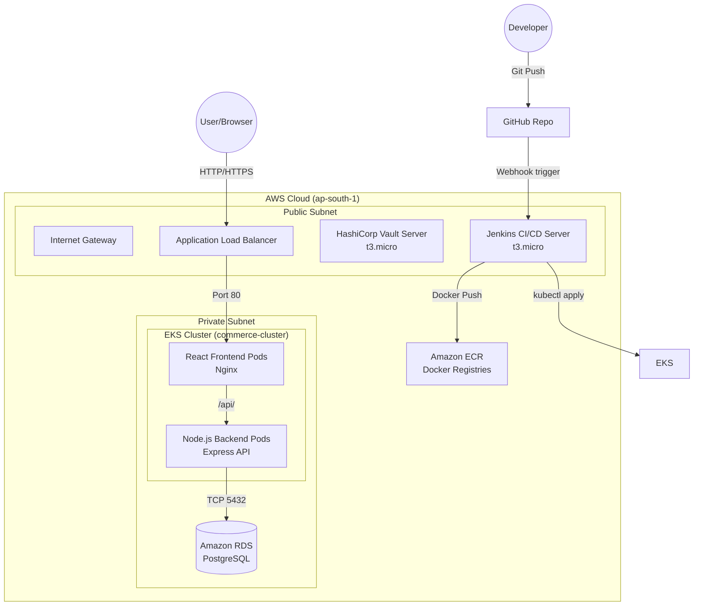

# Multi-Vendor Commerce Platform - Architecture

This document describes the high-level architecture of the Multi-Vendor Commerce Platform.

## Architecture Diagram

## Component Breakdown

1. **Frontend**: React application built with Vite and TailwindCSS, served by an Nginx container. Deployed to EKS as a highly available Deployment.
2. **Backend**: Node.js/Express REST API. Connects to RDS PostgreSQL. Deployed to EKS.
3. **Database**: Amazon RDS (PostgreSQL) in a private subnet for security.
4. **CI/CD**: Jenkins server running on a dedicated EC2 instance. Polls GitHub, builds Docker images, pushes to Amazon ECR, and deploys YAML manifests to EKS.
5. **Secret Management**: HashiCorp Vault securely stores and manages sensitive credentials like the RDS database passwords.
6. **Monitoring & Logging**: Prometheus & Grafana are used for cluster metrics, while the ELK stack handles centralized logging.
